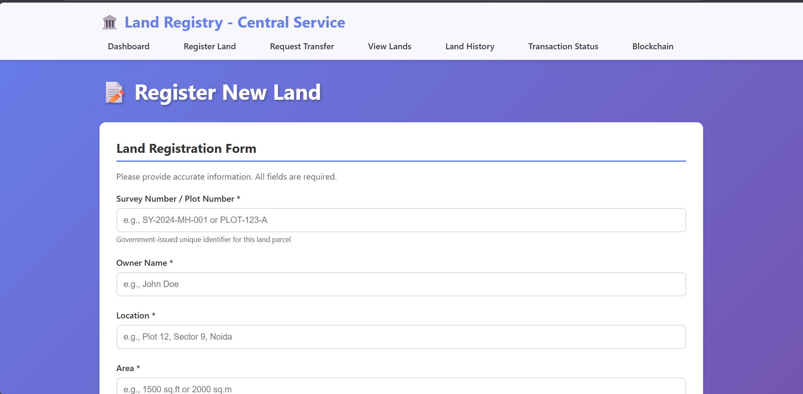
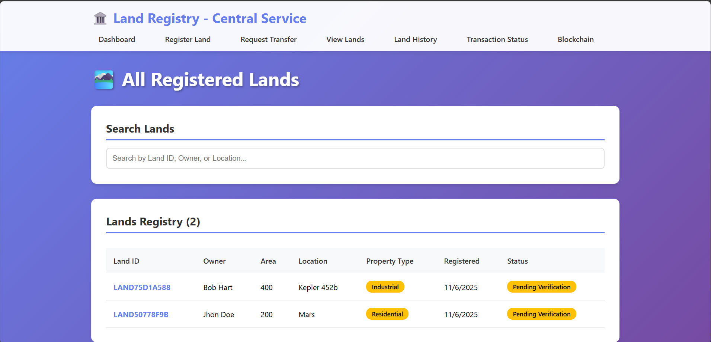
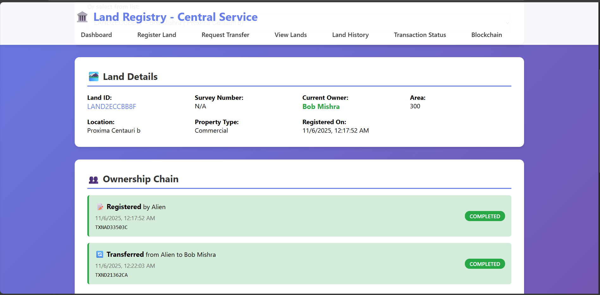
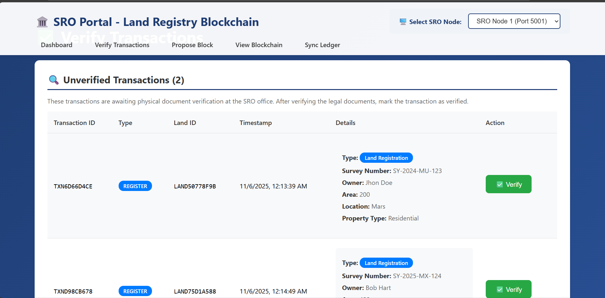
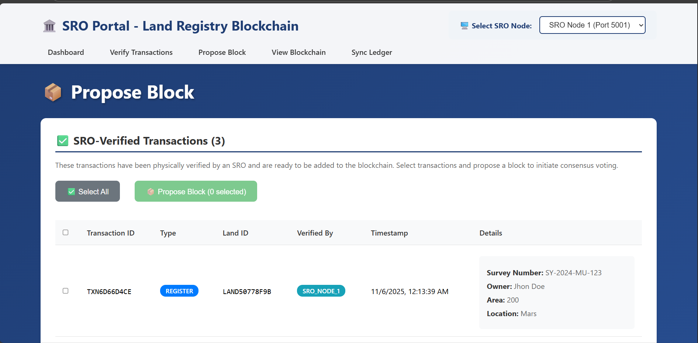
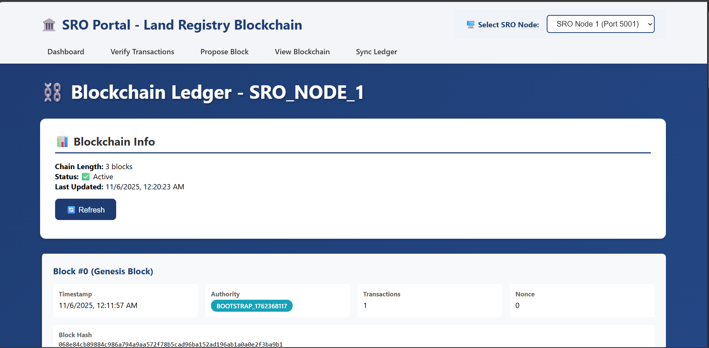

# 🏛️ Blockchain Land Registry System

> A **custom blockchain implementation** from scratch for secure land registration and ownership transfers, featuring **Proof of Authority (PoA)** consensus with voting mechanism.

[](https://www.python.org/)
[](https://flask.palletsprojects.com/)
[](https://reactjs.org/)
[](LICENSE)

Built with Python, Flask, React.js, and SQLite - **No external blockchain libraries used!**

---

## ✨ Features

- 🔗 **Custom Blockchain** - Built from scratch using SHA-256 hashing
- 🗳️ **Proof of Authority** - Permissioned network with majority voting consensus
- 🌐 **Distributed Ledger** - Multiple authority nodes (SRO nodes) maintain synchronized copies
- 📱 **Dual Web Portals** - Citizen portal + SRO officer portal
- 🔐 **Two-Step Verification** - Physical document check + blockchain consensus
- 📜 **Complete Audit Trail** - Immutable land ownership history
- ⚡ **Real-time Voting** - Consensus voting visualization
- 🔄 **Auto-Sync** - Ledger synchronization across all nodes

---

## 🎬 Demo



**Access the Portals:**
- **Central Portal** (Citizens): http://localhost:3000
- **SRO Portal** (Officers): http://localhost:3001

---

## 🏗️ Architecture

```
┌─────────────────┐
│  Bootstrap Node │ ←──┐
│   (Port 5000)   │    │
└─────────────────┘    │
                       │ Sync & Genesis
┌─────────────────┐    │
│   SRO Nodes     │ ───┤
│ (5001-5003)     │ ←──┤ Voting & Consensus
└─────────────────┘    │
       │               │
       └──→ Propose & Vote on Blocks
       │
┌──────▼──────────┐
│ Central Service │
│  (Port 8000)    │  ← SQLite DB
└─────────────────┘
       │
   ┌───┴───┐
   │       │
Citizen  SRO
Portal  Portal
(3000)  (3001)
```

**Key Components:**
- **Bootstrap Node** - Initializes genesis block, maintains node registry
- **SRO Nodes** - Authority nodes that propose blocks and vote
- **Central Service** - Transaction management backend with SQLite
- **Central Portal** - React frontend for citizens
- **SRO Portal** - React frontend for government officers

---

## 📁 Project Structure

```
Flask_Project/
├── common/              # Blockchain core (Block, Transaction, Blockchain classes)
├── bootstrap_node/      # Genesis block & node registry service
├── sro_node_template/   # Authority node (propose, vote, validate)
├── central_service/     # Transaction API & SQLite database
├── frontend_central/    # React app for citizens (Port 3000)
├── frontend_sro/        # React app for SRO officers (Port 3001)
├── scripts/             # PowerShell setup & test scripts
├── requirements.txt     # Python dependencies
└── PROJECT_REPORT.md    # Complete technical documentation
```

📖 **[View Complete Technical Report →](PROJECT_REPORT.md)**

---

## 🚀 Quick Start

### Prerequisites
- **Python 3.8+**
- **Node.js 14+** and npm
- **PowerShell** (Windows)

### Installation

```powershell
# 1. Clone repository
git clone https://github.com/yourusername/blockchain-land-registry.git
cd blockchain-land-registry

# 2. Install Python dependencies
pip install -r requirements.txt

# 3. Install Central Portal dependencies
cd frontend_central
npm install
cd ..

# 4. Install SRO Portal dependencies
cd frontend_sro
npm install
cd ..
```

### Running the System

**Option 1: Quick Start (Recommended)**

Run all backend services at once:
```powershell
.\scripts\run_demo.ps1
```
This will automatically start:
- Bootstrap Node (Port 5000)
- Central Service (Port 8000)
- SRO Node 1 (Port 5001)
- SRO Node 2 (Port 5002)

**Option 2: Run Additional SRO Nodes**

To add more authority nodes for better consensus, run these commands in new terminals:

```powershell
# SRO Node 3 (Port 5004)
$env:FLASK_APP = "sro_node_template/app.py"; $env:NODE_ID = "SRO_NODE_3"; $env:NODE_PORT = "5003"; python -m flask run --host=0.0.0.0 --port=5003

# SRO Node 4 (Port 5004)
$env:FLASK_APP = "sro_node_template/app.py"; $env:NODE_ID = "SRO_NODE_4"; $env:NODE_PORT = "5004"; python -m flask run --host=0.0.0.0 --port=5004

```

> **Note**: The SRO Portal will automatically detect and show only running nodes in the dropdown selector. Make sure to delete old ledger files to ensure proper registration with bootstrap node.

**Start Frontend Applications** (in separate terminals):

```powershell
# Terminal 5 - Central Portal
cd frontend_central
npm start

# Terminal 6 - SRO Portal (in new terminal)
cd frontend_sro
$env:PORT=3001; npm start
```

**Access Applications:**
- Central Portal: http://localhost:3000
- SRO Portal: http://localhost:3001

---

## 🧪 Testing

Run the automated test suite:

```powershell
python scripts\test_demo.py
```

**Test Coverage:**
- ✅ Land registration workflow
- ✅ SRO document verification
- ✅ Block proposal & voting consensus
- ✅ Land transfer transactions
- ✅ Blockchain consistency across nodes
- ✅ Ledger synchronization

---

## 💡 How It Works

### Two-Step Verification Process

**1. Physical Verification (SRO Office)**
- Citizen submits land registration online
- Visits SRO office with physical documents
- Officer verifies documents and marks as "SRO Verified"

**2. Blockchain Consensus (Distributed Network)**
- SRO node proposes block with verified transactions
- All authority nodes vote (ACCEPT/REJECT)
- Majority required (≥N/2) to add block to chain
- Transaction permanently recorded on blockchain

### Consensus Algorithm (PoA + Voting)

```
Citizen Request → SRO Verification → Block Proposal → Voting → Consensus
                                          ↓
                                    All Nodes Vote
                                          ↓
                                  Majority Accept?
                                    ↙        ↘
                              YES: Add       NO: Reject
                                   to Chain      Block
```

**Voting Rules:**
- Each authority node = 1 vote
- Required votes: ≥ N/2 (majority)
- Proposer automatically votes ACCEPT
- Immutability through SHA-256 hashing

---

## 📡 API Overview

| Service | Port | Key Endpoints |
|---------|------|---------------|
| **Bootstrap** | 5000 | `/ledger`, `/nodes/register`, `/block/add` |
| **SRO Nodes** | 5001-5003 | `/propose`, `/vote`, `/sync`, `/ledger` |
| **Central Service** | 8000 | `/land/register`, `/land/transfer`, `/transactions/*` |

📚 **[View Complete API Documentation →](PROJECT_REPORT.md#76-rest-api-endpoints)**

---

## 🎯 Use Cases

- 🏛️ **Government Land Registries** - Transparent property records
- 🏠 **Real Estate Transactions** - Secure ownership transfers
- 📋 **Property Title Management** - Immutable ownership history
- 🌍 **Multi-Region Systems** - Distributed ledger across offices
- 🔍 **Audit & Compliance** - Complete transaction trail

---

## 🛠️ Tech Stack

**Backend**
- Python 3.8+
- Flask 2.3+ (REST APIs)
- SQLite (Transaction database)
- Requests (Node communication)

**Frontend**
- React.js 19.2.0
- React Router DOM 7.9.5
- Axios 1.13.1 (HTTP client)
- React Toastify 11.0.5

**Blockchain**
- Custom implementation (no libraries)
- SHA-256 cryptographic hashing
- JSON persistence

---

## 📸 Screenshots

### Central Portal
<table>
  <tr>
    <td></td>
    <td></td>
    <td></td>
  </tr>
  <tr>
    <td align="center"><b>Register Land</b></td>
    <td align="center"><b>View All Lands</b></td>
    <td align="center"><b>Land History</b></td>
  </tr>
</table>

### SRO Portal
<table>
  <tr>
    <td></td>
    <td></td>
    <td></td>
  </tr>
  <tr>
    <td align="center"><b>Verify Transactions</b></td>
    <td align="center"><b>Propose Block</b></td>
    <td align="center"><b>Blockchain Explorer</b></td>
  </tr>
</table>

---

## 🔐 Key Blockchain Concepts

**Immutability**: Blocks are linked by cryptographic hashing - any change breaks the chain

**Transparency**: All nodes maintain identical copies of the ledger

**Consensus**: Majority voting prevents single-node fraud or manipulation

**Auditability**: Complete ownership history is permanently recorded

**Distributed**: No single point of failure or control

---

## 🔮 Future Enhancements

- [ ] **Authentication** - User login and role-based access control
- [ ] **Smart Contracts** - Automated transfer conditions and payment escrow
- [ ] **IPFS Integration** - Decentralized document storage
- [ ] **Mobile App** - React Native application with QR scanning
- [ ] **Email Notifications** - Transaction status updates
- [ ] **Multi-Region Support** - Cross-chain land transfers
- [ ] **AI Integration** - Automated fraud detection
- [ ] **Analytics Dashboard** - Transaction trends and insights

---

## 📚 Learning Resources

- [Blockchain Basics](https://www.blockchain.com/learning-portal)
- [Proof of Authority Explained](https://en.wikipedia.org/wiki/Proof_of_authority)
- [Flask Documentation](https://flask.palletsprojects.com/)
- [React Documentation](https://react.dev/)
- [Cryptographic Hash Functions](https://en.wikipedia.org/wiki/SHA-2)

---

## 🤝 Contributing

Contributions are welcome! Please feel free to submit a Pull Request.

1. Fork the repository
2. Create your feature branch (`git checkout -b feature/AmazingFeature`)
3. Commit your changes (`git commit -m 'Add some AmazingFeature'`)
4. Push to the branch (`git push origin feature/AmazingFeature`)
5. Open a Pull Request

---

## 📄 License

This project is licensed under the MIT License - see the [LICENSE](LICENSE) file for details.

---

## 👨‍💻 Author

**Your Name**
- GitHub: [@yourusername](https://github.com/yourusername)
- LinkedIn: [Your Profile](https://linkedin.com/in/yourprofile)
- Email: your.email@example.com

---

## 🙏 Acknowledgments

- Built for educational purposes as part of academic coursework
- Inspired by real-world blockchain implementations
- Thanks to the open-source community

---

## 📞 Support

For questions or issues:
- 🐛 [Open an Issue](https://github.com/yourusername/blockchain-land-registry/issues)
- 📧 Email: your.email@example.com
- 💬 [Discussions](https://github.com/yourusername/blockchain-land-registry/discussions)

---

<div align="center">

**⭐ Star this repo if you find it helpful!**

**Built with ❤️ using Python, Flask & React**

[Report Bug](https://github.com/yourusername/blockchain-land-registry/issues) · [Request Feature](https://github.com/yourusername/blockchain-land-registry/issues) · [Documentation](PROJECT_REPORT.md)

</div>
